# Pixlet Emoji Support

Pixlet supports **1753+ Unicode emojis** that can be used seamlessly in any Text widget. Simply include emojis directly in your text strings!

*Note: Some emoji may not render clearly at small sizes due to their  details. They may look better when scaled up.*

## Quick Examples


```python
# Basic usage
render.Text("😀 Hello World!", font="6x10")

# Multiple emojis
render.Text("🎉🎊🎈🎁", font="5x8")

# Mixed content
render.Text("Weather: ☀️ 75°F", font="tb-8")
```

**Examples:**
-  Grinning Face
-  Party Popper
- 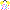 Confetti Ball
-  Balloon
-  Wrapped Gift
-  Sun

## Emoji Categories

###  Smileys & People

**Faces & Expressions:**
                                                  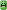         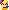            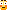                     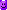 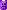    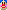 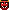   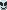  


**People & Body:**
        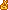                     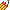 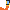              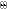     

**Person Activities:**
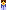 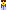     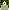 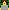 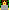       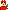  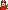   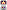 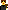  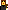

*Note: These complex profession emojis show different people in various occupations - great for representing jobs and careers in your apps.*

###  Nature & Travel

**Animals:**
 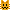  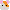 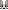 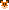       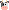 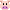   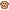 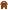 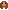 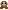 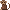    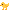  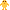 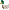  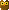 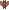  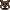 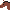  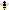 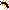   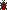                               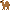 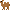  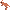 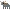 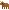 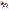                              

**Plants & Nature:**
                       

###  Food & Drink

**Meals:**
                                                                                              

**Beverages:**
                  

###  Activities & Sports

**Sports:**
                                                                                               

###  Travel & Places

**Transport:**
                                                                                                                      

###  Objects & Symbols

**Technology:**
                                                                                                                                                                             

**Symbols:**
                                                                                                                                                                                                                                               

###  Flags

**Country Flags:**
*All 269 country and regional flags are supported!* Examples include:
             

**Special Flags:**
      

- **Rendering Size**: All emoji render at 10×10 pixels when using `render.Text`
- **Multi-sequence Support**: Complex emojis like  (family) work seamlessly

## The Emoji Widget

For creating **large, scalable emojis**, Pixlet provides a dedicated `render.Emoji` widget:

```python
# Create emojis at any size
render.Emoji(emoji="🚀", height=32)   # Large rocket
render.Emoji(emoji="⚡", height=64)   # Huge lightning
render.Emoji(emoji="🎉", height=16)   # Medium party

# Use in layouts
render.Row(
    children = [
        render.Text("Status:", font="6x10"),
        render.Emoji(emoji="✅", height=12),
    ]
)
```

## Example Apps

### Text Widget with Emojis
```python
load("render.star", "render")

def main():
    return render.Root(
        child = render.Column(
            children = [
                render.Text("Weather: ☀ 75°F", font="6x10"),
                render.Text("Status: ✅ Online", font="5x8"),
                render.Text("🎉 Happy Birthday! 🎂", font="tb-8"),
                render.Text("🇺🇸🇬🇧🇫🇷🇩🇪🇯🇵", font="6x10"),
            ]
        )
    )
```


## Supported Emoji Categories

-  **Smileys & Emotion**: 154 emojis
-  **People & Body**: 426 emojis
-  **Animals & Nature**: 158 emojis
-  **Food & Drink**: 135 emojis
-  **Activities**: 84 emojis
-  **Travel & Places**: 216 emojis
-  **Objects**: 258 emojis
-  **Symbols**: 156 emojis
-  **Flags**: 269 emojis

All emojis are automatically detected and rendered when used in `render.Text()` widgets!

## About Emoji Images

The PNG images shown in this documentation are actual renderings from Pixlet's emoji system. They provide a clearer visual representation of how each emoji appears when used in your apps.

## Attribution

The emoji artwork used in Pixlet is provided by the [SerenityOS project](https://emoji.serenityos.org/). SerenityOS has created a beautiful, open-source emoji set that perfectly fits Pixlet's aesthetic for small displays.

- **Emoji Source**: [emoji.serenityos.org](https://emoji.serenityos.org/)
- **SerenityOS Project**: [serenityos.org](https://serenityos.org/)
- **License**: The emoji artwork is released under permissive licensing terms

We're grateful to the SerenityOS community for their excellent work creating these high-quality emoji designs that work beautifully at small pixel sizes!
