<!-- Docs generated by runtime/gen. DO NOT EDIT. -->

# Filters

Pixlet provides a number of image filters that can be applied to widgets.
Most filters are wrappers around the [bild](https://github.com/anthonynsimon/bild) library.

To use these filters, you need to load the `filter` module:

```starlark
load("filter.star", "filter")
```


## Blur
Blur applies a Gaussian blur to the child widget.

#### Attributes
| Name | Type | Description | Required |
| --- | --- | --- | --- |
| `child` | `Widget` | The widget to apply the blur to. | **Y** |
| `radius` | `float / int` | The radius of the Gaussian blur. | **Y** |

#### Example
```starlark
filter.Blur(
    child = render.Image(src="...", width=64, height=64),
    radius = 2.0,
)
```
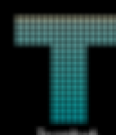

## Brightness
Brightness adjusts the brightness of the child widget.

#### Attributes
| Name | Type | Description | Required |
| --- | --- | --- | --- |
| `child` | `Widget` | The widget to adjust brightness for. | **Y** |
| `change` | `float / int` | The amount to change brightness by. -1.0 is black, 1.0 is white, 0.0 is no change. | **Y** |

#### Example
```starlark
filter.Brightness(
    child = render.Image(src="...", width=64, height=64),
    change = -0.5,
)
```
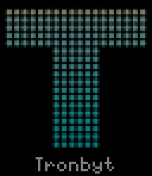

## Contrast
Contrast adjusts the contrast of the child widget.

#### Attributes
| Name | Type | Description | Required |
| --- | --- | --- | --- |
| `child` | `Widget` | The widget to adjust contrast for. | **Y** |
| `factor` | `float / int` | The factor to adjust contrast by. -1.0 is gray, 1.0 is no change, > 1.0 increases contrast. | **Y** |

#### Example
```starlark
filter.Contrast(
    child = render.Image(src="...", width=64, height=64),
    factor = 2.0,
)
```
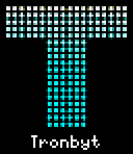

## EdgeDetection
EdgeDetection applies an edge detection filter to the child widget.

#### Attributes
| Name | Type | Description | Required |
| --- | --- | --- | --- |
| `child` | `Widget` | The widget to detect edges on. | **Y** |
| `radius` | `float / int` | The radius of the edge detection kernel. | **Y** |

#### Example
```starlark
filter.EdgeDetection(
    child = render.Image(src="...", width=64, height=64),
    radius = 2.0,
)
```
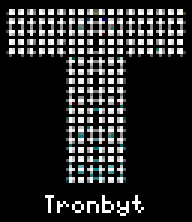

## Emboss
Emboss applies an emboss filter to the child widget.

#### Attributes
| Name | Type | Description | Required |
| --- | --- | --- | --- |
| `child` | `Widget` | The widget to emboss. | **Y** |

#### Example
```starlark
filter.Emboss(
    child = render.Image(src="...", width=64, height=64),
)
```
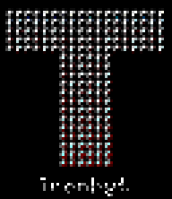

## FlipHorizontal
FlipHorizontal flips the child widget horizontally.

#### Attributes
| Name | Type | Description | Required |
| --- | --- | --- | --- |
| `child` | `Widget` | The widget to flip. | **Y** |

#### Example
```starlark
filter.FlipHorizontal(
    child = render.Image(src="...", width=64, height=64),
)
```
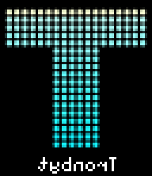

## FlipVertical
FlipVertical flips the child widget vertically.

#### Attributes
| Name | Type | Description | Required |
| --- | --- | --- | --- |
| `child` | `Widget` | The widget to flip. | **Y** |

#### Example
```starlark
filter.FlipVertical(
    child = render.Image(src="...", width=64, height=64),
)
```
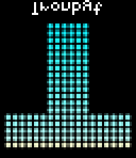

## Gamma
Gamma applies gamma correction to the child widget.

#### Attributes
| Name | Type | Description | Required |
| --- | --- | --- | --- |
| `child` | `Widget` | The widget to apply gamma correction to. | **Y** |
| `gamma` | `float / int` | The gamma value. 1.0 is no change, < 1.0 darkens, > 1.0 lightens. | **Y** |

#### Example
```starlark
filter.Gamma(
    child = render.Image(src="...", width=64, height=64),
    gamma = 0.5,
)
```
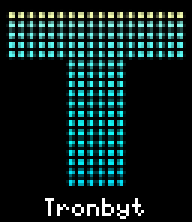

## Grayscale
Grayscale converts the child widget to grayscale.

#### Attributes
| Name | Type | Description | Required |
| --- | --- | --- | --- |
| `child` | `Widget` | The widget to convert to grayscale. | **Y** |

#### Example
```starlark
filter.Grayscale(
    child = render.Image(src="...", width=64, height=64),
)
```
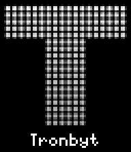

## Hue
Hue adjusts the hue of the child widget.

#### Attributes
| Name | Type | Description | Required |
| --- | --- | --- | --- |
| `child` | `Widget` | The widget to adjust hue for. | **Y** |
| `change` | `float / int` | The amount to change hue by in degrees. | **Y** |

#### Example
```starlark
filter.Hue(
    child = render.Image(src="...", width=64, height=64),
    change = 180.0,
)
```


## Invert
Invert inverts the colors of the child widget.

#### Attributes
| Name | Type | Description | Required |
| --- | --- | --- | --- |
| `child` | `Widget` | The widget to invert. | **Y** |

#### Example
```starlark
filter.Invert(
    child = render.Image(src="...", width=64, height=64),
)
```
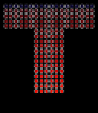

## Rotate
Rotate rotates the child widget by the specified angle.

#### Attributes
| Name | Type | Description | Required |
| --- | --- | --- | --- |
| `child` | `Widget` | The widget to rotate. | **Y** |
| `angle` | `float / int` | The angle to rotate by in degrees. | **Y** |

#### Example
```starlark
filter.Rotate(
    child = render.Image(src="...", width=64, height=64),
    angle = 10.0,
)
```
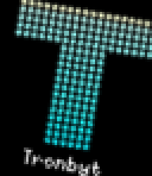

## Saturation
Saturation adjusts the saturation of the child widget.

#### Attributes
| Name | Type | Description | Required |
| --- | --- | --- | --- |
| `child` | `Widget` | The widget to adjust saturation for. | **Y** |
| `factor` | `float / int` | The factor to adjust saturation by. 0.0 is grayscale, 1.0 is no change, > 1.0 increases saturation. | **Y** |

#### Example
```starlark
filter.Saturation(
    child = render.Image(src="...", width=64, height=64),
    factor = 1,
)
```
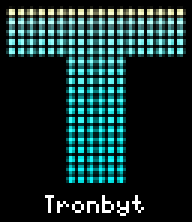

## Sepia
Sepia applies a sepia filter to the child widget.

#### Attributes
| Name | Type | Description | Required |
| --- | --- | --- | --- |
| `child` | `Widget` | The widget to apply sepia to. | **Y** |

#### Example
```starlark
filter.Sepia(
    child = render.Image(src="...", width=64, height=64),
)
```
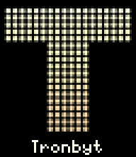

## Sharpen
Sharpen sharpens the child widget.

#### Attributes
| Name | Type | Description | Required |
| --- | --- | --- | --- |
| `child` | `Widget` | The widget to sharpen. | **Y** |

#### Example
```starlark
filter.Sharpen(
    child = render.Image(src="...", width=64, height=64),
)
```
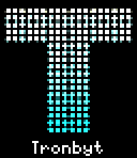

## Shear
Shear shears the child widget horizontally and/or vertically.

#### Attributes
| Name | Type | Description | Required |
| --- | --- | --- | --- |
| `child` | `Widget` | The widget to shear. | **Y** |
| `x_angle` | `float / int` | The angle to shear horizontally in degrees. | **Y** |
| `y_angle` | `float / int` | The angle to shear vertically in degrees. | **Y** |

#### Example
```starlark
filter.Shear(
    child = render.Image(src="...", width=64, height=64),
    x_angle = 10.0,
    y_angle = 0.0,
)
```
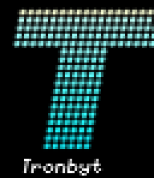

## Threshold
Threshold applies a threshold filter to the child widget, making it black and white.

#### Attributes
| Name | Type | Description | Required |
| --- | --- | --- | --- |
| `child` | `Widget` | The widget to apply threshold to. | **Y** |
| `level` | `float / int` | The threshold level, from 0 to 255. | **Y** |

#### Example
```starlark
filter.Threshold(
    child = render.Image(src="...", width=64, height=64),
    level = 128.0,
)
```
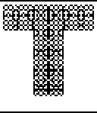
